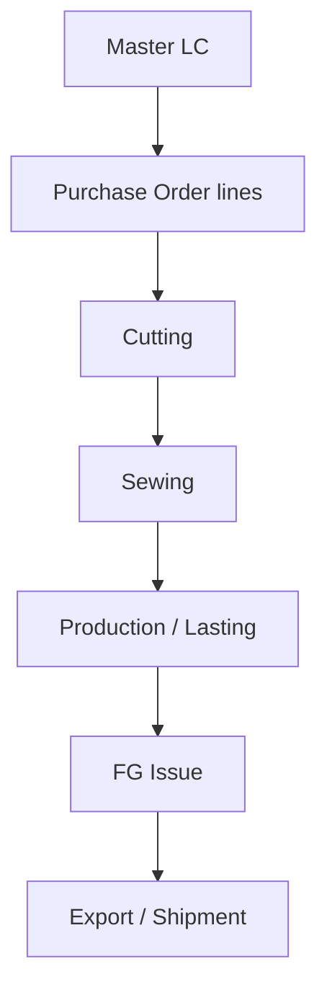

# Footwear ERP System

Production management software for footwear manufacturing.

## Tech Stack

- Flutter (web and mobile)
- Firebase Authentication, Firestore, and Storage
- BLoC and GetIt
- GoRouter
- Clean Architecture

## Features

- Authentication with role-based access
- Master LC management
- Multi-line Purchase Orders with validation
- PO-driven Cutting with detail view
- Admin user, role, and permission management
- Colorful dashboard and module navigation

## ERP workflow

The current application follows PO lines through the production and shipment stages. Each stage records a PO number, article, color, quantity, date, company and factory where applicable.



- **Master LC → PO:** A PO can contain multiple article and color lines. Its allocated quantity and value are checked against the linked Master LC.
- **PO → Cutting:** Cutting may exceed the PO quantity; track the excess separately instead of silently treating it as available PO capacity.
- **Cutting → Sewing → Lasting:** Sewing is limited by available Cutting; Lasting is limited by available Sewing for the matching PO, article and color.
- **Lasting → FG Issue → Export:** FG Issue is limited by available Lasting; Export is limited by available issued goods. The current app represents finished goods through its Issue stage; a separate FG receipt, reservation and shipment ledger belongs to the proposed Customs ERP workflow.
- **Scope of this chart:** It describes the current repository's order-to-export modules. Import clearance, bonded raw materials and customs filing are planned separately and are not shown as implemented features.

## Quick Start

### Prerequisites

- Flutter 3.41+
- Node.js 18+
- Firebase CLI 13+

### Setup

```bash
git clone https://github.com/MdEnamulHaque007/footwear-erp.git
cd footwear-erp
flutter pub get
flutterfire configure
flutter run -d chrome
```

Configure Firebase Authentication and Firestore for the target project before
running the application. Platform-specific credentials such as
`google-services.json` and `GoogleService-Info.plist` are intentionally
gitignored.

## Project Structure

```text
lib/
├── core/          # Constants, theme, utilities, and services
├── data/          # Models and repositories
├── domain/        # Entities and use cases
├── presentation/  # BLoCs, screens, widgets, and routes
└── injection/     # GetIt dependency registration
```

## Development

```bash
flutter pub get
flutter analyze
flutter test
```

## Security

Firestore rules and role-based access control are included. Do not commit
environment files, service-account keys, platform Firebase credential files, or
signing keys.

## Contact

[Md Enamul Haque](https://github.com/MdEnamulHaque007)


## বাংলা ডকুমেন্টেশন / Bengali Documentation

পুরো প্রজেক্টের প্রতিটি `.dart` ফাইলে বিস্তারিত **বাংলা কমেন্ট** যোগ করা হয়েছে।  
কোনো কোড লজিক পরিবর্তন করা হয়নি।

- প্রতিটি ফাইলের উপরে ফাইলের উদ্দেশ্য বাংলায় লেখা আছে।
- বিস্তারিত গাইড দেখুন: [PROJECT_GUIDE_BN.md](PROJECT_GUIDE_BN.md)

This helps any Bengali-speaking developer understand the full architecture and code by reading comments only.
